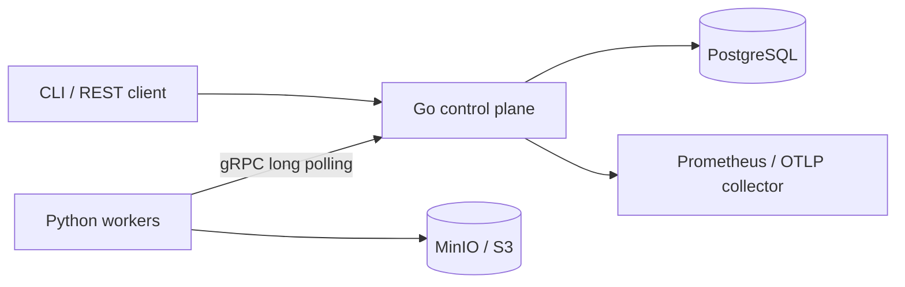

# RunGrid design

RunGrid executes trusted commands at least once. PostgreSQL is authoritative;
workers never write database rows directly. External effects performed by a command
must be idempotent. Fenced result commitment is not exactly-once execution.

## Transaction boundaries

Every RPC mutation has a durable request receipt, payload hash, and response in
the same transaction as its state change. Reusing a request ID with different
content is rejected. Receipts remain durable across server restarts.

Scheduling locks the worker, computes current reservations, and selects the oldest
compatible queued job using `FOR UPDATE SKIP LOCKED`. A partial unique index allows
at most one active attempt per job. All attempt mutations lock the parent job;
registration and placement serialize on the worker. Cancellation and expiration
release reservations by changing attempt state, without maintaining a second
mutable resource counter. PostgreSQL time determines lease validity.

The lease token, worker session, attempt ID, parent state, and unexpired deadline
fence all progress and result writes. An expired attempt can never be revived by a
heartbeat. Cancellation wins against every later completion. A completion committed
before cancellation remains successful. Retries append attempts; manual retry is
allowed only for failed jobs and extends the attempt budget by one explicitly.

Timeouts apply per attempt from lease acquisition, including startup and uploads.
Reapers run in each server; job row locks make concurrent reaping safe. Graceful
worker shutdown drains current work and stops leasing. Lost connectivity causes
the worker to kill its process group before its locally tracked lease expires.

Artifacts use immutable attempt-scoped keys. Metadata is committed only through a
valid lease. A checkpoint is eligible for recovery only after its progress receipt
commits. Orphaned uploads are possible and require retention cleanup. Capacity is
admission accounting, not OS isolation; use trusted workloads on dedicated workers.
GPU counts do not assign device identities in v0.1.

## Scope and evidence

No Kubernetes, broker, accounts, or untrusted-code sandbox. Local ports bind to
loopback. Deploy remotely only behind authenticated TLS transport. Benchmark outputs
must record source revision, workload, worker count, host details, and raw samples.
No throughput, coverage, or recovery number is a claim until regenerated.

References: [PostgreSQL queue locking](https://www.postgresql.org/docs/current/sql-select.html),
[gRPC generated Python interfaces](https://grpc.io/docs/languages/python/generated-code/).
